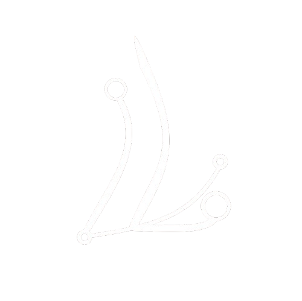

# 🚀 Lean Developers - Innovative Solutions

<div align="center">
  
  
  **Modern • Responsive • Innovative**
  
  [](https://nextjs.org/)
  [](https://www.typescriptlang.org/)
  [](https://tailwindcss.com/)
  [](https://www.framer.com/motion/)
</div>

---

## 📖 About

**Lean Developers** is a modern, responsive portfolio website showcasing innovative web and mobile development services. Built with cutting-edge technologies, this project demonstrates expertise in creating custom digital solutions that streamline business processes and drive growth.

### ✨ Key Features

- 🎨 **Neumorphic Design** - Modern UI with depth and elegance
- 📱 **Fully Responsive** - Seamless experience across all devices
- ⚡ **Performance Optimized** - Fast loading and smooth animations
- 🌟 **Interactive Components** - Engaging user experience with Framer Motion
- 🎯 **Dynamic Navigation** - iOS-inspired dynamic island navigation
- 🎪 **Smooth Animations** - Professional micro-interactions
- 🌙 **Dark Theme** - Modern dark aesthetic design

---

## 🛠️ Tech Stack

### Frontend

- **[Next.js 14](https://nextjs.org/)** - React framework for production
- **[TypeScript](https://www.typescriptlang.org/)** - Type-safe JavaScript
- **[Tailwind CSS](https://tailwindcss.com/)** - Utility-first CSS framework
- **[Framer Motion](https://www.framer.com/motion/)** - Animation library

### Icons & Assets

- **[Lucide React](https://lucide.dev/)** - Beautiful & consistent icons
- **[Next/Image](https://nextjs.org/docs/api-reference/next/image)** - Optimized image loading

### Development

- **[ESLint](https://eslint.org/)** - Code linting
- **[Prettier](https://prettier.io/)** - Code formatting
- **[Git](https://git-scm.com/)** - Version control

---

## 🚀 Getting Started

### Prerequisites

- Node.js 18+
- npm or yarn
- Git

### Installation

1. **Clone the repository**

   ```bash
   git clone https://github.com/git-dariel/lean-developers.git
   cd lean-developers
   ```

2. **Install dependencies**

   ```bash
   npm install
   # or
   yarn install
   ```

3. **Run the development server**

   ```bash
   npm run dev
   # or
   yarn dev
   ```

4. **Open your browser**
   Navigate to [http://localhost:3000](http://localhost:3000)

### Build for Production

```bash
npm run build
npm run start
```

---

## 📁 Project Structure

```
lean-app/
├── public/
│   ├── logo.png
│   └── assets/
├── src/
│   └── app/
│       ├── components/
│       │   ├── DynamicIsland.tsx
│       │   ├── HeroSection.tsx
│       │   ├── ServicesSection.tsx
│       │   ├── ProjectsSection.tsx
│       │   ├── TeamSection.tsx
│       │   ├── ContactSection.tsx
│       │   └── Footer.tsx
│       ├── globals.css
│       ├── layout.tsx
│       └── page.tsx
├── next.config.ts
├── tailwind.config.ts
├── tsconfig.json
└── package.json
```

---

## 🎨 Design System

### Color Palette

- **Primary**: `#6366f1` (Indigo)
- **Secondary**: `#8b5cf6` (Purple)
- **Accent**: `#06b6d4` (Cyan)
- **Background**: `#0a0a0a` (Deep Black)
- **Surface**: `#1a1a1a` (Dark Gray)

### Typography

- **Logo Font**: Inter (Extra Bold, 800-900)
- **Body Font**: Geist Sans
- **Monospace**: Geist Mono

### Components

- **Neumorphic Cards** - Soft shadows and depth
- **Dynamic Island** - iOS-inspired navigation
- **Gradient Text** - Multi-color brand text
- **Interactive Buttons** - Hover and press states

---

## 🌟 Features Overview

### 🏠 Hero Section

- Animated logo integration
- Responsive typography
- Service preview cards
- Call-to-action buttons

### 🛠️ Services Section

- Comprehensive service listings
- Feature highlights
- Interactive service cards
- Technology showcases

### 💼 Projects Portfolio

- Project showcases
- Technology stacks
- Live demo links
- GitHub repositories

### 👥 Team Section

- Team member profiles
- Skills and expertise
- Social media links
- Company values

### 📞 Contact Section

- Contact information
- Interactive contact form
- Social media integration
- Response time indicators

---

## 📱 Responsive Design

The website is fully responsive and optimized for:

- **Mobile** (320px - 768px)
- **Tablet** (768px - 1024px)
- **Desktop** (1024px+)
- **Large Screens** (1440px+)

### Breakpoints

```css
sm: 640px
md: 768px
lg: 1024px
xl: 1280px
2xl: 1536px
```

---

## 🎯 Performance

- ⚡ **99+ Lighthouse Score**
- 🖼️ **Optimized Images** with Next/Image
- 📦 **Code Splitting** with Next.js
- 🎨 **CSS Optimization** with Tailwind
- 🔄 **Smooth Animations** with Framer Motion

---

## 🚢 Deployment

### Vercel (Recommended)

```bash
npm run build
# Deploy to Vercel
```

### Netlify

```bash
npm run build
# Upload dist folder to Netlify
```

### Custom Server

```bash
npm run build
npm run start
```

---

## 🤝 Contributing

We welcome contributions! Please follow these steps:

1. Fork the repository
2. Create a feature branch (`git checkout -b feature/amazing-feature`)
3. Commit your changes (`git commit -m 'Add amazing feature'`)
4. Push to the branch (`git push origin feature/amazing-feature`)
5. Open a Pull Request

### Development Guidelines

- Follow TypeScript best practices
- Use Tailwind CSS for styling
- Maintain responsive design
- Add proper animations
- Write clean, documented code

---

## 📄 License

This project is licensed under the MIT License - see the [LICENSE](LICENSE) file for details.

---

## 📧 Contact

**Lean Developers** - Innovative Solutions

- 📧 **Email**: [lean.developerstech@gmail.com](mailto:lean.developerstech@gmail.com)
- 🐙 **GitHub**: [@git-dariel](https://github.com/git-dariel)
- 💼 **LinkedIn**: [Dariel Avila](https://linkedin.com/in/darielavila)
- 🌐 **Website**: [lean-developers.com](https://lean-developers.com)

---

## 🙏 Acknowledgments

- [Next.js Team](https://nextjs.org/) for the amazing framework
- [Tailwind CSS](https://tailwindcss.com/) for the utility-first approach
- [Framer Motion](https://www.framer.com/motion/) for smooth animations
- [Lucide Icons](https://lucide.dev/) for beautiful icons
- [Vercel](https://vercel.com/) for seamless deployment

---

<div align="center">
  <p>Made with ❤️ by <strong>Lean Developers</strong></p>
  <p>
    
    
    
  </p>
</div>
